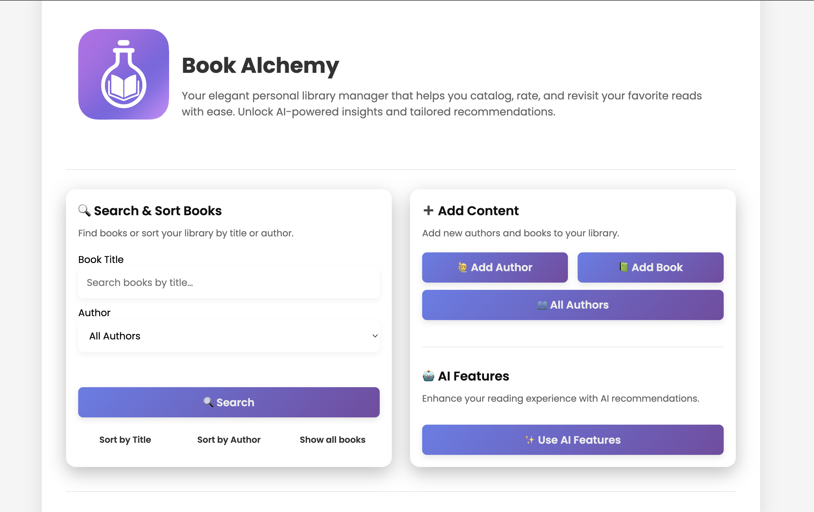
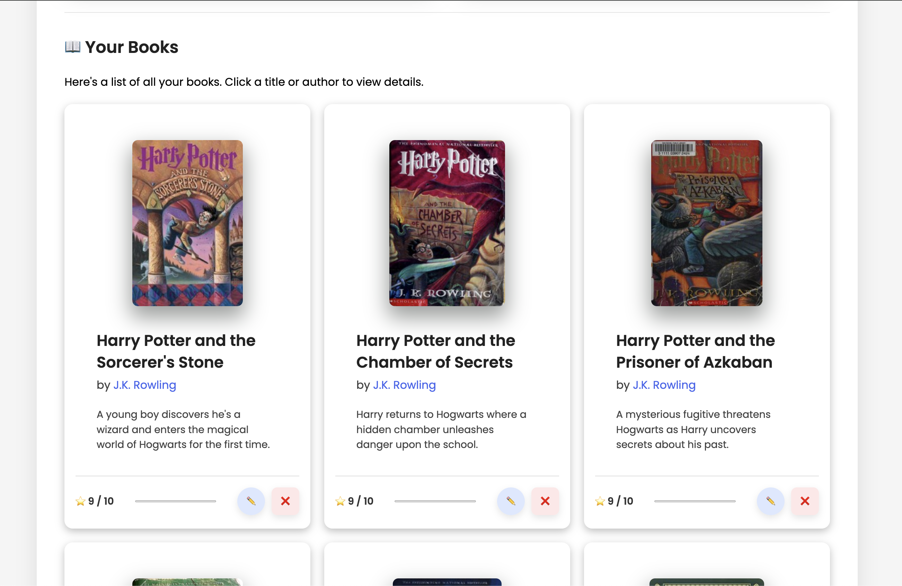

# Book Alchemy  

A Flask-based web application for managing authors and books, designed for small-scale library use. Features include author and book management, AI-powered book recommendations based on your favourite books, and persistent storage using SQLAlchemy ORM.

---

## ✨ Features

- 📚 Author and book management with full CRUD operations
- 🤖 AI-powered book recommendation 
- 🧾 Personalized reading experience with reading-progress and rating tracking

---
## Preview



---
## 🛠️ Tech Stack

- Python 3.11+
- Flask
- SQLAlchemy
- SQLite (default)
- python-dotenv
- Flask-Limiter

---

## 🧱 Project Structure
```
.
├── app
│   ├── config.py                 # Environment configs
│   ├── data                      # Seed and database files
│   ├── events.py                 # Enforce SQLite foreign key constraints
│   ├── models.py                 # SQLAlchemy models for authors and books
│   ├── services
│   │   └── ai_services.py        # Recommendation logic
│   ├── utils.py                  # Helper functions (e.g. parsing, db commits)
│   ├── blueprints                # Route blueprints
│   ├── static                    # Static assets
│   │   ├── assets
│   │   └── styles
│   │       ├── main.css
│   │       └── main.js
│   └── templates                 # Jinja2 templates
│       ├── authors
│       ├── books
│       ├── partials
│       ├── home.html
│       └── recommend.html
├── logs                          # Contains server log files (not committed)
├── run.py                        # App entry point
├── .env                          # Environment variables (not committed)
└── requirements.txt
```
---

## 🚀 Getting Started

### 1. Clone the Repository
```bash
git clone https://github.com/ItsHarfer/Book-Alchemy.git
cd Book-Alchemy
```

### 2. Set Up the Environment
Create a .env file in the root directory:

```bash
SECRET_KEY=your-secret-key
OPENAI_API_KEY=your-openai-key
FLASK_CONFIG=development
```

**Note:** For the AI-powered recommendation feature, you need your own OpenAI account and API key. You can register at [https://platform.openai.com/](https://platform.openai.com/) 
and retrieve your API key to use in the `.env` file. The Secret Key (Optional) in this case is for SQL password protected cases when you want to use the system in production.

### For self-hosting on a custom server (Codio, Docker, etc.):
Add these additional variables to `.env` (not needed locally):
```
FLASK_CONFIG=production
FLASK_RUN_HOST=0.0.0.0
FLASK_RUN_PORT=5002
```


### 3. Install Requirements

- Python 3.11 or higher
- Flask
- SQLAlchemy
- python-dotenv

To install dependencies:
```bash
pip install -r requirements.txt
```

### 4. Run the App
```bash
python run.py
```

Visit http://localhost:5000 in your browser.

---

## 👤 Author

Martin Haferanke  
GitHub: [@ItsHarfer](https://github.com/ItsHarfer)  
Email: `martin.haferanke@gmail.com`

---

## 📄 License

Licensed under the MIT License.  
This project is intended for educational and library management use cases.
